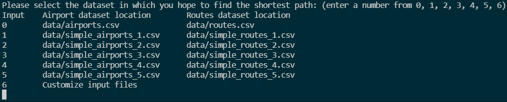
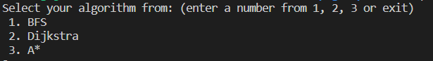
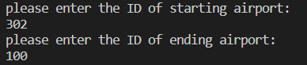
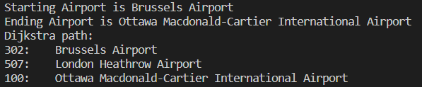

<h1 align="center"> CS 225 Final Project</h1>
<h3 align="center"> liwens3-yihanz8-zhekaig2-sji15 </h3>

## Document files
* [Team Contract](CONTRACT.md)
* [Project Proposal](Project_Proposal.md)
* [Development Log](Development_Log.md)
* [Results](Results.md)

## Source code
* Algorithms: `algorithm/*`
  * [AStar.h](algorithm/AStar.h) · [AStar.cpp](algorithm/AStar.cpp)
  * [BFS.h](algorithm/BFS.h) · [BFS.cpp](algorithm/BFS.cpp)
  * [Dijkstra.h](algorithm/Dijkstra.h) · [Dijkstra.cpp](algorithm/Dijkstra.cpp)

## Video
(WIP)

## Building the program
1. Clone the project repository
2. `cd liwens3-yihanz8-zhekaig2-sji15`
3. Enter the command `make` in the terminal

## Running the program

1. After building the program, run `./openflight` in the terminal.

2. The terminal prompt will ask you to select the dataset in which you hope to find the shortest path.

    

3. There are 3 options appeared `1. BFS`, `2. Dijkstra`, `3. A*`. Choose one of the algorithms by entering the number `1`, `2` or `3`.

    

4. Then, the terminal will ask you to enter the ID of starting airport and ending airport (Just type the ID with numbers like `302`).

    

5. Finally, the program will use the chosen algorithm to calculate the shortest path from the starting airport to the ending airport and print out the corresponding airport IDs and names along the path including the start and end point. The result will look like this:

    

## Testing the program

1. To build the tests, run the command `make test`
2. run `./test` for comprehensive tests
    - To test parts of the program:
      - run `./test [graph]` for OpenFlight graph basic tests
      - run `./test [bfs]` for BFS algorithm tests
      - run `./test [dataset=n]` (n=1,2,3,4) for testing individual datasets
      - run `./test [dijkstra]` for Dijkstra's Algorithm tests
      - run `./test [astar]` for A* Algorithm tests

