<h1 align="center"> CS 225 Final Project Result </h1>

## Overview
For our project, we selected openflight dataset to implement the following algorithms: BFS, Dijkstra's algorithm and A* search algorithms. We wish we could use these three graph algorithms to find the shortest path between different airports in real life. In this report, we will analyze these algorithms and show the outcomes of them.

## Implementation
There are two main datasets routes.csv and airports.csv. Airports.csv contains the information of airports and routes.csv contains the information of routes between different airports. We implement three classes to process the datasets: Airport.cpp, Route.cpp and Openflight.cpp. 

- Airport.cpp enables us to access the IDs, locations, names, and other information of the airports in the dataset. 
- Route.cpp enables us to get the information of the source and destination of a route, calculate the distance of that route and store the route by tracing the name of airports. Also, we used the Haversine function to compute the distance of every route.
- OpenFlight.cpp mainly enables us to access all routes for a specific airport and use unordered map for storing the data of airports and routes.

### Breadth First Search

The first algorithm we implemented is Breadth-First Search. In our project, we use this algorithm to search each airport from source to destination.
To avoid processing a node more than once, we use an `unordered_map` (key: Airport, value: True if the airport has been explored, false otherwise) to mark explored airports.
We use  `queue` to determine the order of traversal. Also, we use `getAdjacentRoute` to traverse adjacent airports before moving on to the next airport.
The simple BFS is only appliable when the graph is connected. To make it work on the disconnected graph, we modified the algorithm to perform BFS on each unvisited airport.
To test the correctness of our BFS algorithm, we developed test cases on five smaller datasets (including simple, complex cycles and disconnected graphs) to checked whether the output path is the same as the expected path.

**Simple Cycle** (Sample #1): 4 is the starting point. 

Path of the traversed airports (ID): 4, 2, 1, 3

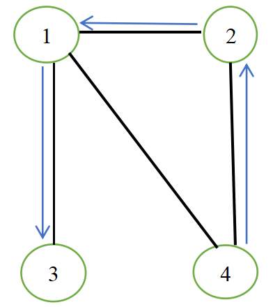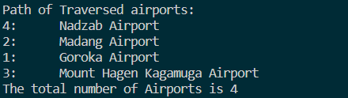

**Complex Cycle** (Sample #2):

Path of the traversed airports (ID): 2922, 6969, 2975, 2990, 2965, 6156, 2979

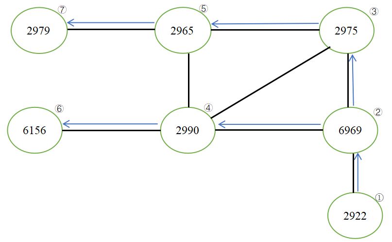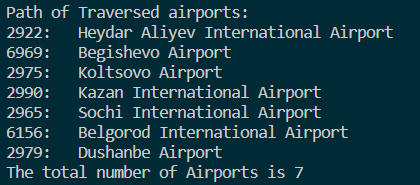

**Disconnected graph** (Sample #5):

Path of the IDs of traversed airports (ID): 9481, 8335, 6435, 3395, 3393

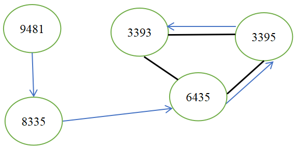 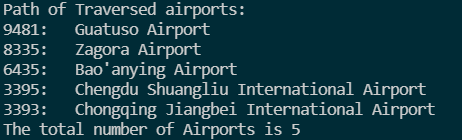

### Dijkstra's Algorithm

The second algorithm is the Dijkstra's Algorithm where we use the constructor to process most of the data. Here, we use the priority queue to calculate the shortest distance and unordered_map to store the corresponding distance for each airport. First, we initialize the distance of each airport to DBL_MAX, then we loop through the airports and calculate the distance to the source airport. During this process, we put the neighbor of the current airport into a priority queue(q), mark the current airport as visited, store the distance in a parameter “dis”, and store the previous airport in “last_airport”.  Finally, if the priority queue is empty, we finish our loop and the construction finished. 

The member function contains get_distance, get_path and isExists and we can use get_distance and get_path to access the data we want. 

In order to test the Dijkstra algorithms, we first implement test cases on five simplified  dataset and then run on the total dataset.
The testcases contain short-path, long-path test cases and we also test on disconnected airports. We compare the routes we get from our algorithms with the actual ones and also check whether the distance is correct.

**Here is the result running on the full dataset**:

The starting airport is Stockholm-Arlanda Airport and the destination is Zhengzhou Xinzheng International Airport. The shortest path between two airports is 
737->2948->2910->3399->3375

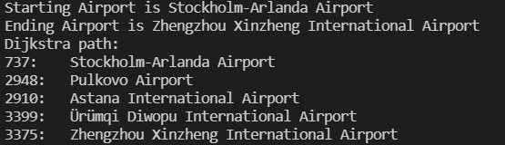

**Sample 1**: Simple Cycle 

Here is the example running on simple_airports_1.csv. It starts from the number 3 airport(Mount Hagen Kagamuga Airport), passes number 1 airport and ends at the number 4 airport.

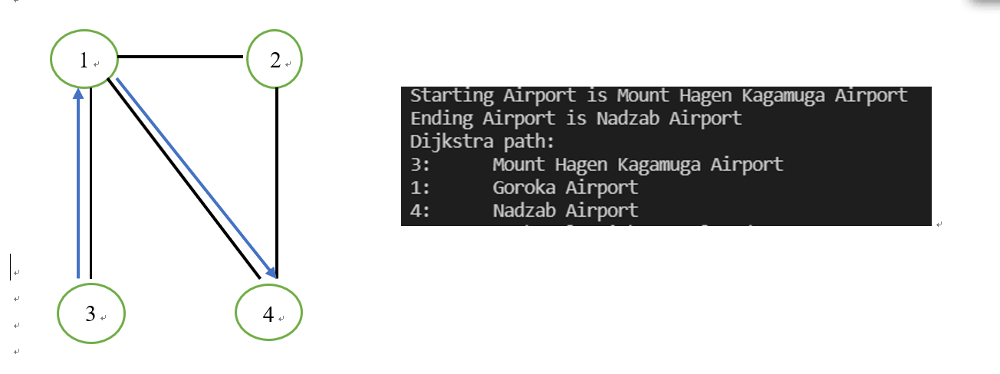

**Sample 2**: Complex Cycle

This is the example running on simple_airports_2.csv. It starts from airport Dushanbe and ends at Heydar Aliyev International Airport. The path is 2979->2965->2990->6969->2922

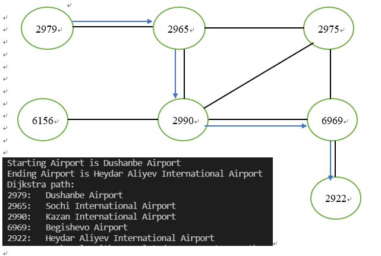

**Sample 3**: One path graph

This is the example running on simple_airports_3.csv. It starts from airport Verona Villafranca Airport and ends at Brussels Airport. The path is 1550->502->1064->302

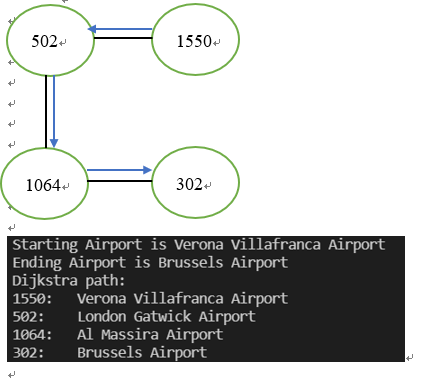

**Sample 4**: Disconnected graph

This is the example running on simple_airports_5.csv. It starts at number 6435 airport and ends at number 8335 airport. Since there is no path between two airports,  the result would be an error message that there is no route. 

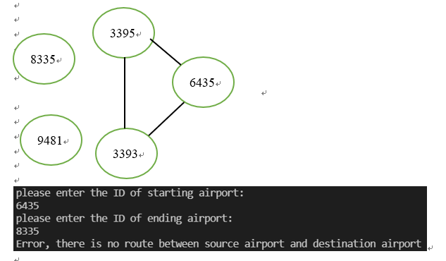

### A* Search
A* is an informed search algorithm. In our project, it starts from a specific starting airport and aims to find a path to the target airport having the least cost.
At each iteration of its main loop, we use priority queue to select the airport that minimizes
                                                                    f(n) = g(n) + h(n)
where n is the next airport on the path, g(n) is the route distance from source airport to n. h(n) is a heuristic function that estimates the shortest distance from n to the target airport. 
Then we record the sum of the current nodes' g(n) and the route distance to its neighbours as tentative_g. If tentative_g is smaller than its neighbours' original g(n), we update its neighours’ g(n) and f(n). Moreover, we need to add its neighbours to our priority queue. Also, we record the previous airport to reconstruct our path. If the airport we pop from our priority queue is our target, then we finished our search. If the priority queue is empty and our targret is still never reached, this means there does not exist a route between source and destination airport.

**Application on full dataset**:

In this example, we choose Goroka Airport as our source and London Gatwick Airport as our destination.
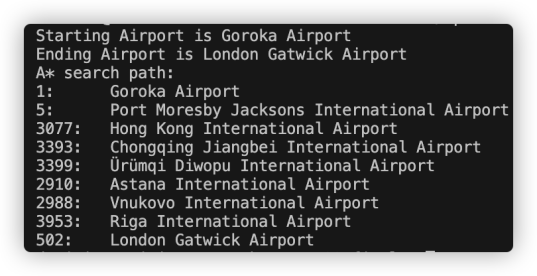

If we choose disconnected airports, A* search will provide error messages accordingly.

Application on test dataset to prove our algorithm is successful:

**Simple Cycle**: (Sample #1)

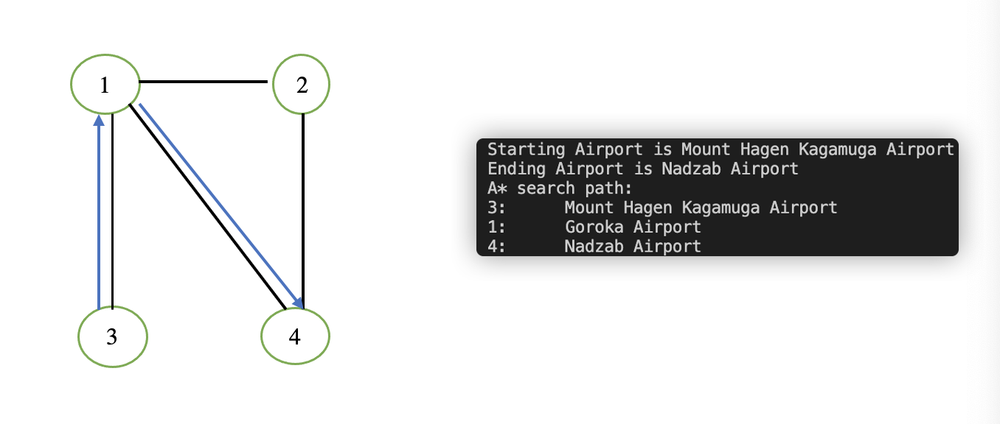

Start node 3, End node 4

After our manual computation, the path is node 3 -> node 1 -> node 4 which conforms to the result of our algorithm.

**Complex Cycle**: (Sample #2)

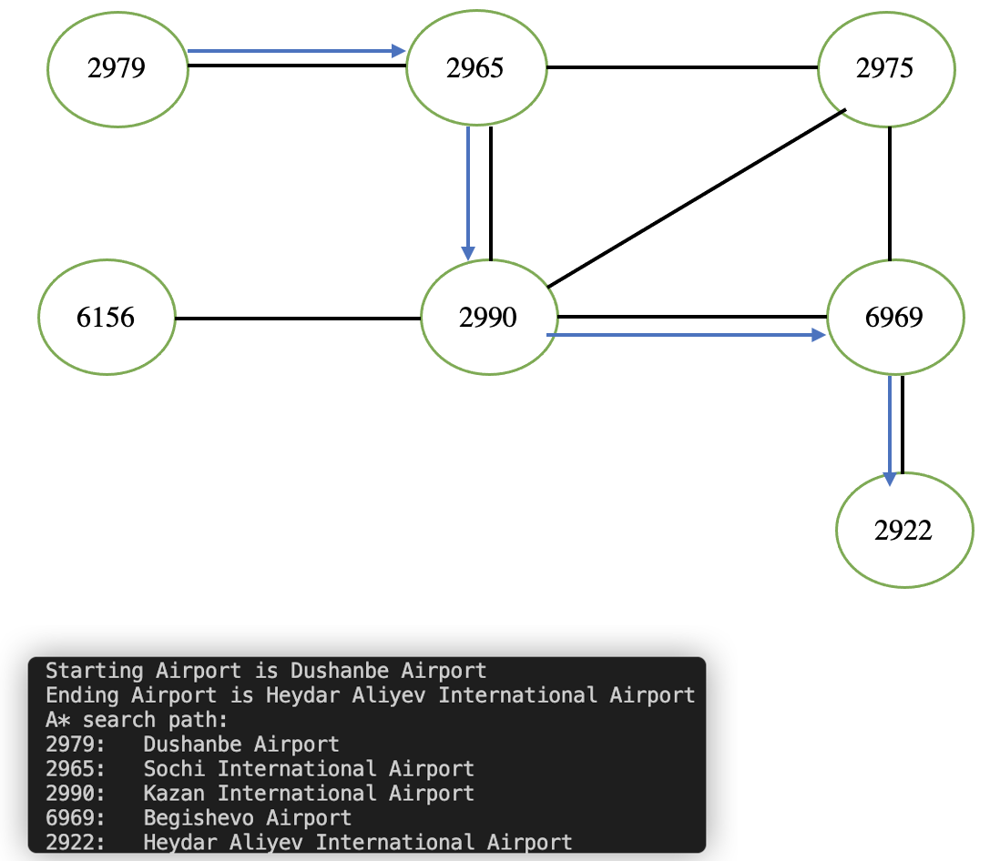

Start Node: 2979 End Node: 2922

After our manual computation, the path is node 2979 -> node 2965 -> node 2990 -> Node 6969 -> Node 2922 which conforms to the result of our algorithm.

**Connected Without Cycle**: (Sample 3)

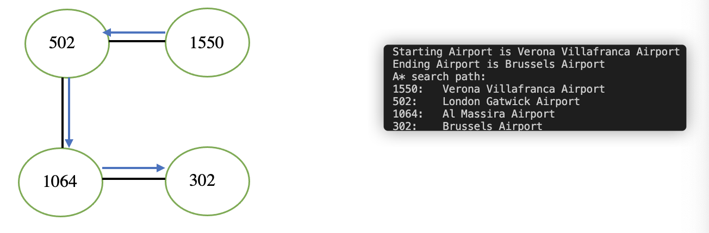

Start Node: 1550 End Node: 302

After our manual computation, the path is node 1550 -> node 502 -> node 1064 -> Node 302 which conforms to the result of our algorithm

**Connected Without Cycle**: (Sample 4)

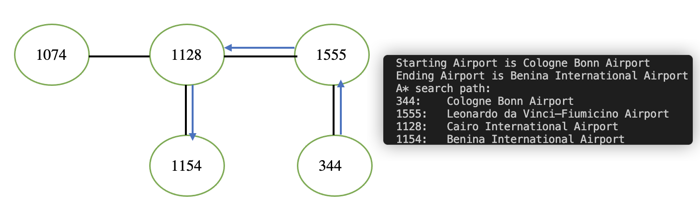

Start Node: 344 End Node: 1154

After our manual computation, the path is node 344 -> node 1555 -> node 1128 -> Node 1154 which conforms to the result of our algorithm.

**Disconnected**: (Sample 5)

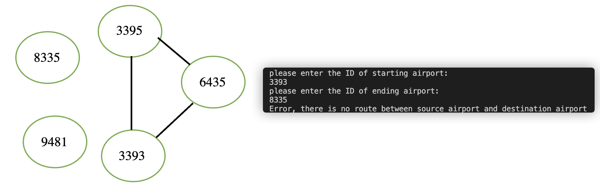

Start Node: 3393	End Node: 8335

Since these two nodes are disconnected, there is a route between them.

