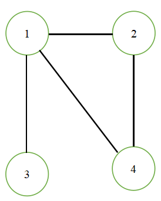
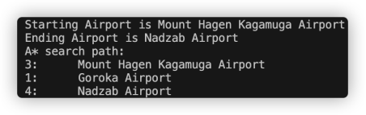

<h1 align="center"> CS 225 Final Project Result </h1>

[TOC]

## Overview


## Data structures and Algorithms

### Breadth First Search (WIP)
The first algorithm we implemented the Breadth First Search. In our project, we use this algorithm to search each airport from source to destination.

Methods:

`vector<Airport> getPath(OpenFlight graph)` get the path of all visited airports during BFS traversal

`int getCount()` get the number of visited airports during BFS traversal

`Airport getEnd()` get the ending airport after BFS traversal


To test the correctness of our BFS algorithm, we developed test cases on four smaller datasets and checked whether the output path is same as the expected path.

### Dijkstra's Algorithm

### A* Search







Initial:
```C++
g (3) = 0							
h (3) = 281						
f (3) = g (3) + h (3) = 281
```
