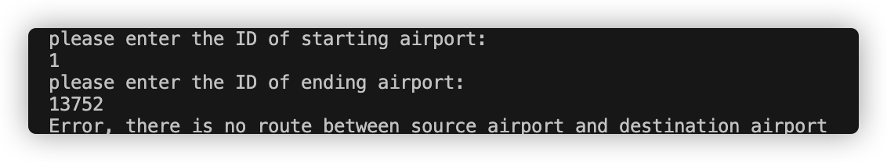

<h1 align="center"> CS 225 Final Project Result </h1>

## Overview
For our project, we selected openflight dataset to implement the following algorithms: BFS, Dijkstra's algorithm and A* search algorithms. We wish we could use this three graph algorithms to find the shortest path between different airports in real lives. In this report, we will analyze these algorithms and show the outcomes of them.
## Implementations
There are two main datasets routes.csv and airports.csv. Airports.csv contains thoughts of names of airports and routes.csv contains routes between different airports. We implement three cpp files to process the datasets: Airport.cpp, OpenFlight.cpp and Route.cpp. Airport.cpp enables us to access the IDs, locations, names and so on of the airports in the dataset. OpenFlight.cpp mainly enables us to access all routes for a specific airport and use unorderd map for storing the data of airports and routes. Route.cpp enables us to fix the source and destination of a route, calculate the distance of that route and store the route by tracing the name of airports. We used Haversine function to compute the distance of every route.
### Breadth First Search

The first algorithm we implemented the Breadth First Search. In our project, we use this algorithm to search each airport from source to destination.
To avoid processing a node more than once, we use an `unordered_map` (key: Airport, value: True if the airport has been explored, false otherwise) to mark explored airports.
We use a `queue` that contain the frontier airports along which the algorithm is currently searching. 
The simple BFS is only appliable when the graph is connected. To make it work on disconnected graph, we modified the algorithm to perform BFS from each unvisited airport.
To test the correctness of our BFS algorithm, we developed test cases on five smaller datasets (including simple, complex cycles and disconnected graphs) and checked whether the output path is same as the expected path.

**Simple Cycle** (Sample #1): 4 is the starting point. 

Path of the traversed airports (ID): 4, 2, 1, 3

**Complex Cycle** (Sample #2):

Path of the traversed airports (ID): 2922, 6969, 2975, 2990, 2965, 6156, 2979

**Disconnected graph** (Sample #5):

Path of the IDs of traversed airports (ID): 9481, 8335, 6435, 3395, 3393

 

### Dijkstra's Algorithm

### A* Search
A* is an informed search algorithm. In our project, it starts from a specific starting airport and aims to find a path to the target airport having the least cost.
At each iteration of its main loop, we use priority queue to select the airport that minimizes
                                                                    f(n) = g(n) + h(n)
where n is the next airport on the path, g(n) is the route distance from source airport to n. h(n) is a heuristic function that estimates the shortest distance from n to the target airport. 
Then we compute its neighours’ corresponding f(n) and compare their new f(n) with their original f(n). If new f(n) is smaller than original f(n), then we update its neighours’ f(n) and add its neighbours to our priority queue. Moreover, we record the previous airport to reconstruct our path. If the airport we pop from our priority queue is our target, then we finished our search. If the priority queue is empty and our targret still is never reached, this means there does not exists route between source and destination airport.

Application on full dataset:

In this example, we choose Goroka Airport as our source and London Gatwick Airport as our destination.

If we choose disconnected airports, A* search will provide error messages accordingly.

Application on test dataset to prove our algorithm is successful:

Simple Cycle: (Sample #1)

Start node 3, End node 4

After our manual computation, the path is node 3 -> node 1 -> node 4 which conforms to the result of our algorithm.

Complex Cycle: (Sample #2)

Start Node: 2979 End Node: 2922

After our manual computation, the path is node 2979 -> node 2965 -> node 2990 -> Node 6969 -> Node 2922 which conforms to the result of our algorithm.

Connected Without Cycle: (Sample 3)

Start Node: 1550 End Node: 302

After our manual computation, the path is node 1550 -> node 502 -> node 1064 -> Node 302 which conforms to the result of our algorithm

Connected Without Cycle: (Sample 4)

Start Node: 344 End Node: 1154

After our manual computation, the path is node 344 -> node 1555 -> node 1128 -> Node 1154 which conforms to the result of our algorithm.

Disconnected: (Sample 5)

Start Node: 3393	End Node: 8335

Since these two nodes are disconnected, there is route between them.

